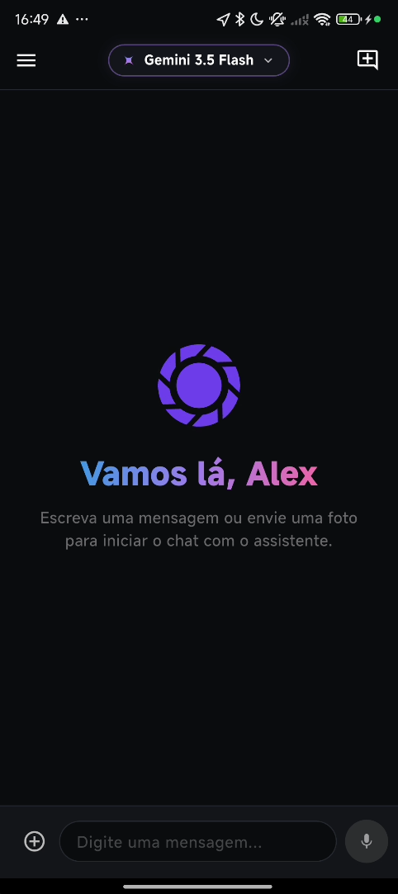
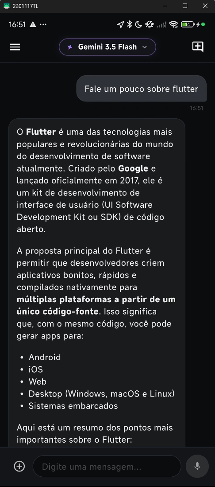
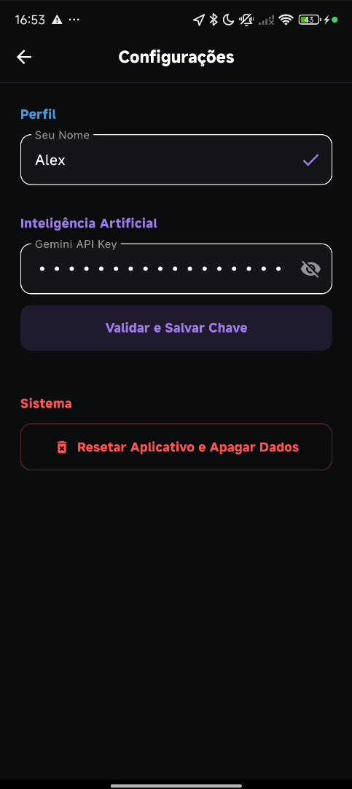

<p align="center">
  
</p>

<h1 align="center">AI Chat</h1>

<p align="center">
  Chatbot inteligente e multimodal, integrado à API do Google Gemini, com suporte a conversas em texto, análise de imagens e persistência local.
</p>

---


<p align="center">
  <!-- Substitua os caminhos abaixo pelos caminhos reais das suas capturas de tela quando disponíveis -->
  
  &nbsp;&nbsp;&nbsp;
  
  &nbsp;&nbsp;&nbsp;
  
</p>

---

## Funcionalidades

- **Chat Dinâmico:** Conversas em tempo real com as inteligências artificiais do Google.
- **Múltiplos Modelos:** Alternância entre modelos de linguagem como Gemini 3.5 Flash e Gemini 3.1 Lite.
- **Multimodalidade:** Envio de fotos tiradas com a câmera ou escolhidas da galeria para análise da IA.
- **Histórico Offline:** Conversas salvas localmente no dispositivo (SQLite) e organizadas no menu lateral.
- **Configurações Personalizadas:** Tela dedicada para inserção de API Key e definição do nome de usuário.
- **Interface Escura (Dark Theme):** Visual moderno focado em modo escuro com animações personalizadas de abertura.

---

## Arquitetura e Tecnologias

O projeto segue os princípios de separação de conceitos de arquitetura limpa (Clean Architecture) e o padrão de apresentação **MVVM (Model-View-ViewModel)**.

### Tecnologias Utilizadas
- **Gerenciamento de Estado e Injeção de Dependência:** `provider`
- **Banco de Dados Local:** `sqflite` (SQLite)
- **Integração com IA:** `google_generative_ai`
- **Tratamento de Erros:** `result_dart` (Result Pattern)
- **Gerenciamento de Comandos:** `result_command` (Command Pattern)
- **Validação de Entradas:** `lucid_validation`
- **Markdown para Respostas:** `gpt_markdown`

### Estrutura de Pastas
```text
lib/
 ┣ config/        # Injeção de dependências (Providers)
 ┣ core/          # Componentes visuais comuns, temas e estilos globais
 ┣ data/          # Fontes de dados locais/remotos e implementações de repositórios
 ┣ domain/        # Entidades puras, interfaces de repositórios e regras de validação
 ┣ features/      # Módulos organizados por funcionalidades (Home, Settings, Splash)
 ┃  ┣ home/
 ┃  ┃  ┣ viewmodels/  # ViewModels dedicados (Chat, Session, Settings)
 ┃  ┃  ┣ widgets/     # Componentes de interface da Home
 ┃  ┃  ┗ home_page.dart
 ┃  ┗ settings/
 ┃  ┗ splash/
 ┗ main.dart
```

---

## Como Executar o Projeto

### Pré-requisitos
- Flutter SDK (compatível com a versão definida em `.fvmrc` ou posterior)
- Chave de API do Gemini (pode ser gerada no Google AI Studio)

### Instalação e Execução
1. Clone este repositório:
   ```bash
   git clone https://github.com/seu-usuario/ai_chat.git
   ```
2. Entre no diretório do projeto:
   ```bash
   cd ai_chat
   ```
3. Instale as dependências necessárias:
   ```bash
   flutter pub get
   ```
4. Execute o aplicativo:
   ```bash
   flutter run
   ```

---

## Contexto Pedagógico

Este aplicativo foi estruturado de forma incremental para atender aos requisitos da disciplina de desenvolvimento mobile, abordando os seguintes conceitos:
- Componentização de layouts fluídos e responsivos (`ListView`, `SingleChildScrollView`, `BottomSheets`).
- Consumo e tratamento de retornos de APIs REST.
- Persistência e gerenciamento local de estados persistentes no dispositivo (SQLite e SharedPreferences).
- Manipulação de hardware por meio de plugins nativos (Câmera e Galeria).

---

Desenvolvido com Flutter e Dart.